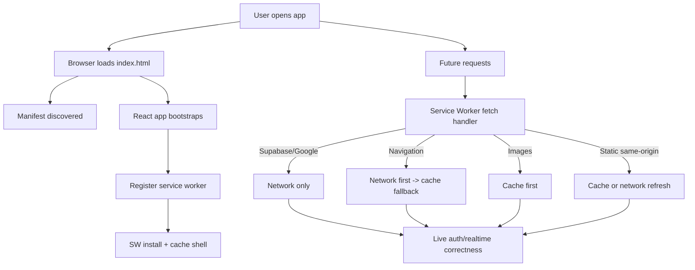

# PitchIQ PWA Study Notes

## 1) What is a PWA?

A Progressive Web App (PWA) is a web application enhanced with browser platform features so it behaves more like an installable app while still being delivered from the web.

Core building blocks:
- Web App Manifest: app identity (name, icons, display mode, theme color).
- Service Worker: programmable network/cache layer between app and network.
- HTTPS: required for service worker and secure installability.

A PWA still runs in the browser.
On supported platforms it can also be installed and launched in an app-like window (standalone display mode).

## 2) Why use a PWA?

Compared with a regular web app:
- Better repeat-load performance through caching.
- Installability (home screen / desktop app launcher).
- Offline or poor-network resilience.
- More app-like launch and UI chrome behavior.

Trade-offs:
- More caching/update complexity.
- Must design stale-data behavior carefully.
- Browser and OS behavior differs (especially iOS nuances).

## 3) Design and Architecture in This Project

This project was converted using a manual PWA implementation (manifest + custom service worker), while keeping existing app architecture unchanged.

Important design choices for this conversion:
- Keep current navigation architecture (state-driven screens, no router migration).
- Keep realtime and auth correctness over aggressive caching.
- Update strategy: background check, new version activates on next reopen.
- OAuth policy: localhost + production domain only.

## 3.1 Quick Reference: PWA Files in This Repo

Short description of the main PWA-related files:

- [public/manifest.webmanifest](public/manifest.webmanifest)
  - App identity for install prompts (name, icons, start URL, display mode, colors).
- [public/sw.js](public/sw.js)
  - Service worker logic (install, cache strategy, activate cleanup, fetch handling).
- [src/main.jsx](src/main.jsx)
  - Registers the service worker in production and checks for updates.
- [index.html](index.html)
  - Connects manifest and PWA metadata (theme color, Apple install tags, icons).
- [src/App.jsx](src/App.jsx) and [src/App.css](src/App.css)
  - User-facing offline awareness (online/offline listeners, toast/banner styles).
- [public/pwa-192x192.png](public/pwa-192x192.png), [public/pwa-512x512.png](public/pwa-512x512.png), [public/pwa-192x192-maskable.png](public/pwa-192x192-maskable.png), [public/pwa-512x512-maskable.png](public/pwa-512x512-maskable.png)
  - Install and launcher icons used by Android/Desktop/iOS surfaces.

Short description of [vercel.json](vercel.json):

- It is Vercel deployment configuration for edge behavior.
- In this project it controls:
  - Cache headers for PWA assets ([sw.js](public/sw.js), [manifest.webmanifest](public/manifest.webmanifest), and [public/team-logos](public/team-logos)).
  - Security headers (CSP, X-Frame-Options, Referrer-Policy, and more).
- Practical effect:
  - Faster repeat loads through correct caching.
  - Safer production defaults through response-header hardening.

## 4) File-by-File Changes

## 4.1 App metadata and install surface

- [index.html](index.html)
  - Added PWA metadata and manifest linkage.
  - Added Apple web app tags for iOS install experience.

Snippet:

```html
<meta name="theme-color" content="#07091A" />
<meta name="apple-mobile-web-app-capable" content="yes" />
<link rel="apple-touch-icon" href="/pwa-192x192.png" />
<link rel="manifest" href="/manifest.webmanifest" />
```

- [public/manifest.webmanifest](public/manifest.webmanifest)
  - Defines app name, launch scope/start URL, standalone mode, colors.
  - References standard and maskable icons.

Snippet:

```json
{
  "name": "PitchIQ",
  "short_name": "PitchIQ",
  "start_url": "/",
  "scope": "/",
  "display": "standalone",
  "background_color": "#07091A",
  "theme_color": "#07091A"
}
```

- Icon assets in [public](public)
  - [public/pwa-192x192.png](public/pwa-192x192.png)
  - [public/pwa-512x512.png](public/pwa-512x512.png)
  - [public/pwa-192x192-maskable.png](public/pwa-192x192-maskable.png)
  - [public/pwa-512x512-maskable.png](public/pwa-512x512-maskable.png)

## 4.2 Service worker registration and lifecycle

- [src/main.jsx](src/main.jsx)
  - Registers service worker in production.
  - Triggers background update check.

Snippet:

```js
if (import.meta.env.PROD && "serviceWorker" in navigator) {
  window.addEventListener("load", () => {
    void navigator.serviceWorker
      .register("/sw.js")
      .then((registration) => {
        void registration.update();
      });
  });
}
```

## 4.3 Service worker runtime behavior

- [public/sw.js](public/sw.js)
  - Defines named caches.
  - Pre-caches shell files on install.
  - Cleans old caches on activate.
  - Uses policy-based fetch strategies by request type.

Key constants:

```js
const STATIC_CACHE = "pitchiq-static-v1";
const IMAGE_CACHE = "pitchiq-images-v1";
```

Sensitive request bypass:

```js
function isAuthOrLiveDataRequest(url) {
  if (/supabase\.co$/i.test(url.hostname)) return true;
  if (/google\.com$/i.test(url.hostname) || /googleapis\.com$/i.test(url.hostname)) return true;
  return false;
}
```

Navigation strategy:
- Try network first for latest app shell.
- On failure, serve cached index fallback.

Image strategy:
- Cache-first for image requests.

Static/same-origin strategy:
- Serve cache when available.
- Update cache from network when possible.

## 4.4 Offline awareness in UI

- [src/App.jsx](src/App.jsx)
  - Added online/offline event listeners.
  - Shows connectivity toasts.
  - Displays a persistent offline banner to indicate potential staleness.

Snippet:

```js
window.addEventListener("offline", handleOffline);
window.addEventListener("online", handleOnline);
```

- [src/App.css](src/App.css)
  - Added styling for the offline banner.

## 4.5 Deployment and security headers

- [vercel.json](vercel.json)
  - Ensures service worker is not cached aggressively.
  - Revalidates manifest.
  - Adds security headers including CSP.

Snippet:

```json
{
  "source": "/sw.js",
  "headers": [
    { "key": "Cache-Control", "value": "no-cache, no-store, must-revalidate" }
  ]
}
```

CSP was added to constrain script/style/connect/frame behavior while allowing required Supabase and Google OAuth endpoints.

## 4.6 OAuth hardening documentation

Docs were aligned to actual auth architecture (Supabase OAuth, not direct Google SDK runtime):
- [GOOGLE_OAUTH_SETUP.md](GOOGLE_OAUTH_SETUP.md)
- [OAUTH_TROUBLESHOOTING.md](OAUTH_TROUBLESHOOTING.md)

## 5) End-to-End Runtime Flow

## 5.1 First online visit

1. Browser loads [index.html](index.html).
2. Manifest link is discovered.
3. App bootstraps via [src/main.jsx](src/main.jsx).
4. Service worker registers after window load.
5. Service worker installs and pre-caches shell assets from [public/sw.js](public/sw.js).

## 5.2 Subsequent visits (online)

1. Service worker intercepts requests.
2. Navigation prefers network for freshness.
3. Static and image assets can come from cache.
4. App still uses live network for Supabase and Google auth-related requests.

## 5.3 Offline or unstable network

1. If navigation network request fails, service worker serves cached app shell fallback.
2. App can launch with last cached shell/assets.
3. Offline banner and toast indicate connectivity state.
4. Live/realtime/auth-dependent actions still require network.

## 5.4 Update flow

1. Browser checks for updated service worker script.
2. New worker is installed in background.
3. Activation follows next lifecycle handoff (next reopen behavior selected).
4. User gets updated app without app-store style manual update steps.

## 6) Caching Strategy Matrix Used Here

- Supabase and Google domains
  - Strategy: network-only bypass in service worker.
  - Reason: avoid stale auth/session/live data issues.

- Navigation requests
  - Strategy: network-first with cached app shell fallback.
  - Reason: freshness first, offline safety second.

- Images
  - Strategy: cache-first.
  - Reason: low risk and fast repeat rendering.

- Same-origin static assets
  - Strategy: cache fallback plus opportunistic refresh.
  - Reason: improve speed while still updating.

## 7) Architectural Diagram



## 8) Why This Design Fits PitchIQ

PitchIQ has realtime and auth-critical flows:
- Live match updates
- User predictions
- Approval and profile flags
- OAuth session continuity

Because of this, conversion prioritized correctness and safety:
- No caching of auth-sensitive external domains.
- Conservative offline behavior with user visibility.
- Fast shell availability without compromising live truth sources.

## 9) Validation Performed

- Production build passed.
- Dist output includes PWA artifacts:
  - index.html
  - manifest.webmanifest
  - sw.js
  - all icon files
- Header config updated for Vercel deployment behavior.

## 10) Known Scope Boundaries

Implemented:
- Installable PWA
- Basic offline shell resilience
- Security header hardening
- OAuth doc alignment

Not implemented in this phase:
- Offline mutation queue for predictions
- Router/deep-link architecture migration
- Preview-domain OAuth support

## 11) Suggested Study Path

1. Start with [public/manifest.webmanifest](public/manifest.webmanifest) to understand install identity.
2. Read [src/main.jsx](src/main.jsx) for registration lifecycle.
3. Deep dive [public/sw.js](public/sw.js) fetch branching and caching policies.
4. Connect UI behavior in [src/App.jsx](src/App.jsx) with offline state.
5. Review deployment hardening in [vercel.json](vercel.json).
6. Review auth docs for environment and allowlist discipline:
- [GOOGLE_OAUTH_SETUP.md](GOOGLE_OAUTH_SETUP.md)
- [OAUTH_TROUBLESHOOTING.md](OAUTH_TROUBLESHOOTING.md)

---

This document is intended as a practical architecture reference tied to your current codebase, not just generic PWA theory.
